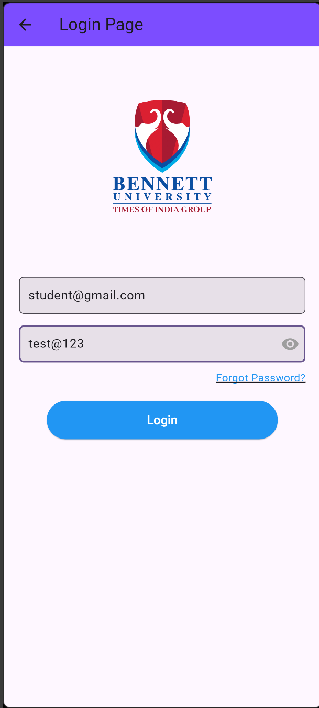
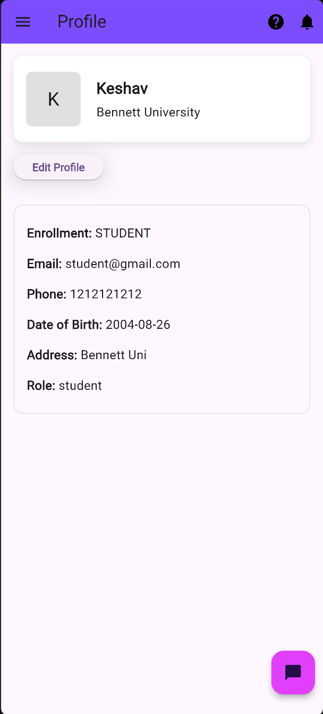
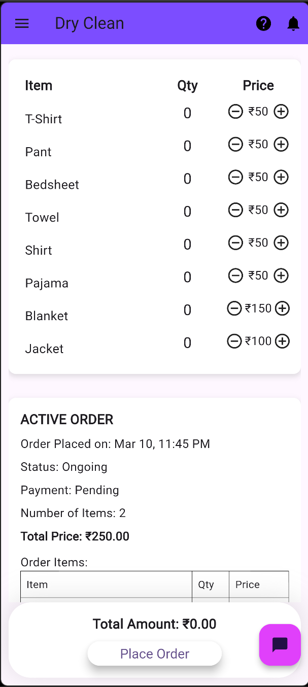

# 🧺 Laundry Management App

<p align="left">
A Flutter + Firebase Platform for Managing Student Laundry Orders, Staff Processing, and Real-Time Order Tracking
</p>

<p align="center">

[](https://laundry-deploy-vercel-keshavs-projects-72997bdc.vercel.app/)
[](https://drive.google.com/file/d/1rd8RXdKdPFiDJIu6RHPNuR7nIP8dBcv7/view?usp=drive_link)


</p>

---

# 📌 Overview

The **Laundry Management App** is a mobile application designed to simplify laundry service workflows for students and staff.

Built using **Flutter and Firebase**, the platform allows students to place laundry orders while staff manage processing, payment verification, and order status updates.

The system replaces manual laundry tracking with a **real-time digital workflow**, improving efficiency, transparency, and order tracking.

The application provides:

* Student laundry order placement
* Staff order management dashboard
* Real-time order status updates
* Booking history tracking
* Secure Firebase authentication
* Cloud Firestore database integration
* Responsive Flutter UI

---

# 🧠 Problem Statement

Laundry services in student hostels or campuses often face problems such as:

* Manual order registers
* Lack of order tracking
* No real-time updates
* Poor communication between staff and students
* Payment confusion

This project solves these issues by introducing a **centralized mobile application that manages laundry orders digitally with real-time updates and structured workflows**.

---

# 🚀 Features

### Student Features

* Secure login using email/password
* Place laundry orders
* Select service type and cloth quantity
* View order history
* Track order status
* Profile management

### Staff Features

* Staff login dashboard
* View incoming laundry orders
* Update order processing status
* Verify payments
* Manage order queue

### System Features

* Firebase Authentication
* Firestore real-time database
* Responsive Flutter UI
* Secure cloud data storage

---

# 📲 Download & Demo Access

* 🔗 **APK Download**
  [https://drive.google.com/file/d/1rd8RXdKdPFiDJIu6RHPNuR7nIP8dBcv7/view?usp=drive_link](https://drive.google.com/file/d/1rd8RXdKdPFiDJIu6RHPNuR7nIP8dBcv7/view?usp=drive_link)

* 🌐 **Web Demo**
  [https://laundry-deploy-vercel-keshavs-projects-72997bdc.vercel.app/](https://laundry-deploy-vercel-keshavs-projects-72997bdc.vercel.app/)

---

# 🧪 Demo Login Credentials

### 👨‍🎓 Student Account

```
Email: student@gmail.com
Password: test@123
```

### 🧑‍🔧 Staff Account

```
Email: staff@gmail.com
Password: test@123
```

⚠️ These are **demo accounts for testing only**.

In a real deployment, users would be **added and managed by the administrator**.

---

# 🏗 System Architecture

## Frontend

* Flutter
* Dart
* Material UI components
* Responsive mobile layouts
* Custom reusable widgets

## Backend

* Firebase Authentication
* Firebase Firestore
* Cloud-based real-time updates

## Database

* Cloud Firestore
* NoSQL document-based structure
* Real-time synchronization

---

# 🖼 Application Screenshots

<p align="center">



</p>

---

# 🗃 Database Design

Firestore collections used in the system:

```
users
 ├── email
 ├── role (student / staff)

orders
 ├── userId
 ├── serviceType
 ├── clothCount
 ├── status
 ├── paymentStatus
 ├── createdAt
```

This structure enables **real-time order updates and scalable data management**.

---

# 🎨 UI Design System

The UI follows a **mobile-first Flutter design** with:

* Clean material components
* Responsive layouts
* Reusable widget architecture
* Simple and intuitive user flow

Screens include:

```
Login
Dashboard
Order Placement
Order History
Profile
```

---

# ⚙️ Tech Stack

| Layer            | Technology        |
| ---------------- | ----------------- |
| Mobile Framework | Flutter           |
| Language         | Dart              |
| Backend          | Firebase          |
| Authentication   | Firebase Auth     |
| Database         | Cloud Firestore   |
| Hosting          | Vercel (Web Demo) |

---

# 🚀 Getting Started

## Clone Repository

```
git clone https://github.com/YOUR_USERNAME/laundry-management-app.git
cd laundry-management-app
```

---

## Install Dependencies

```
flutter pub get
```

---

## Run Application

```
flutter run
```

---

# 🔐 Firebase Setup

To connect the app with Firebase:

1️⃣ Create a project in **Firebase Console**

2️⃣ Add Android app and download:

```
google-services.json
```

Place it inside:

```
android/app/google-services.json
```

3️⃣ (Optional) Add iOS app and place:

```
GoogleService-Info.plist
```

inside:

```
ios/Runner/
```

4️⃣ Enable:

* **Email/Password Authentication**
* **Cloud Firestore**

⚠️ Firebase config files are excluded from the repository for security.

---

# 📂 Project Structure

```
lib/
 ├── main.dart
 ├── pages/
 │   ├── login.dart
 │   ├── dashboard.dart
 │   ├── profile.dart
 ├── components/
 │   └── custom_widgets.dart

assets/
firebase/
```

---

# 📈 Production Deployment

The system supports:

* Firebase cloud backend
* Android APK distribution
* Web demo deployment
* Scalable Firestore database

---

# 🛡 Security Notes

Sensitive files excluded from the repository:

* `google-services.json`
* Firebase API keys
* local build files

---

# 💼 Portfolio Summary

Developed a **Flutter + Firebase Laundry Management Application** that enables students to place laundry orders and staff to manage processing with **real-time Firestore updates, secure authentication, and a responsive mobile UI**.

---

# 👨‍💻 Author

**Keshav**
B.Tech CSE – Bennett University
Full-Stack & Mobile Developer

🔗 LinkedIn
[www.linkedin.com/in/keshav262004](http://www.linkedin.com/in/keshav262004)

---

# ⭐ Support

If you like this project, consider giving it a **star ⭐ on GitHub**.

---
